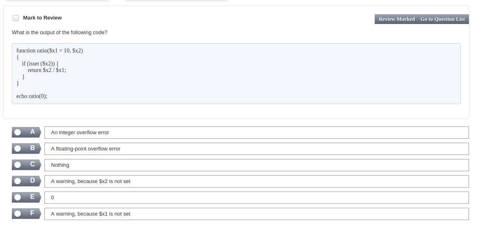

-------------
The Active Record design pattern is used for which of the following?

1.  Separating business and presentation logic within a system
2.  Creating audit trails of all file changes
3.  Managing output handlers
4.  Easily storing and retrieving objects in the database
5.  Integrating PHP and Ruby on Rails projects

------------------

------------

http://joxi.ru/Vm6l9zVtxqw6MA

----------------

http://joxi.ru/L214XlVH6qPBgm

-----------------
http://joxi.ru/n2YvZBjUjpqa8A

-------------------

http://joxi.ru/L214XlVH6qPpgm

------------------

http://joxi.ru/Dr8j41ViklQ152

-----------------

http://joxi.ru/xAe6vEVHYeo10r

----------
