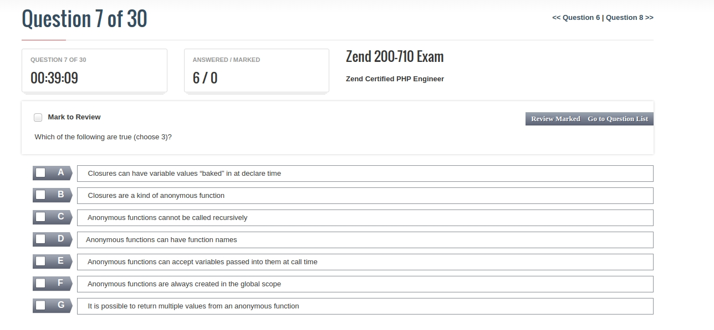
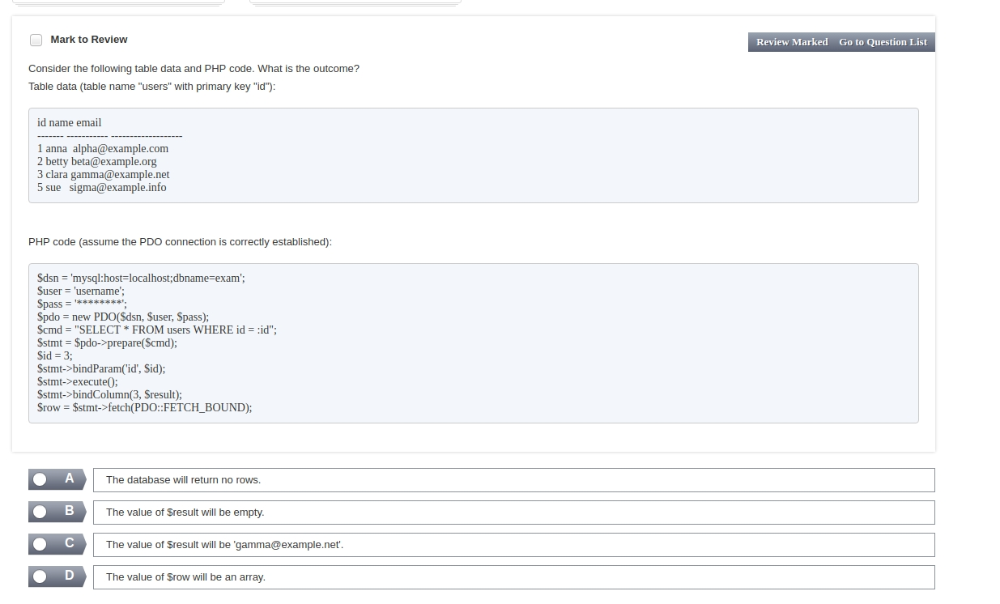
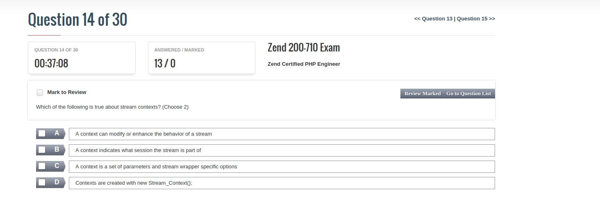
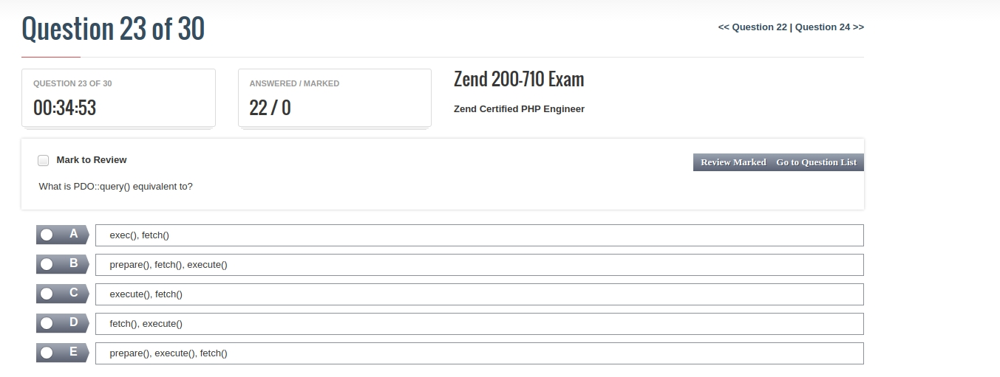
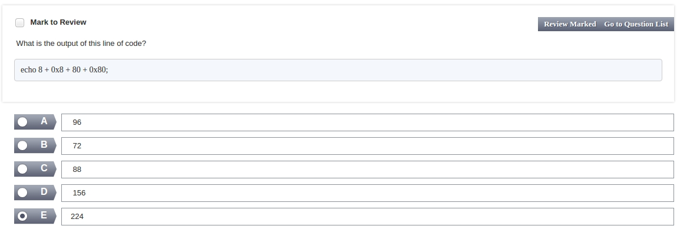
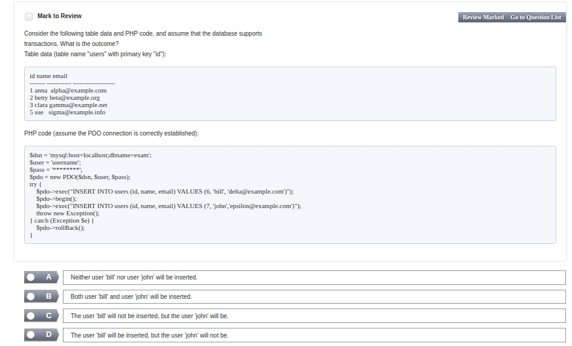
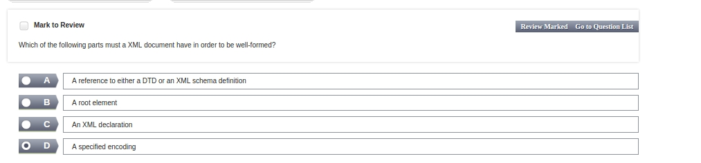
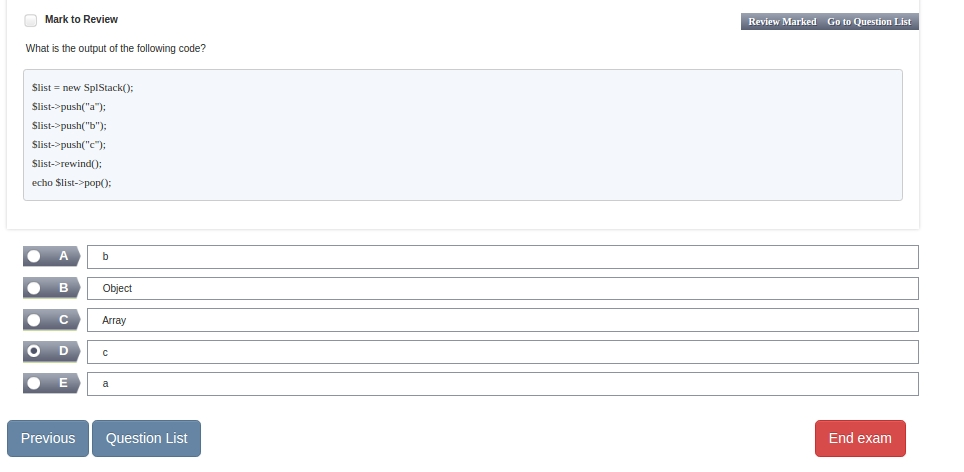
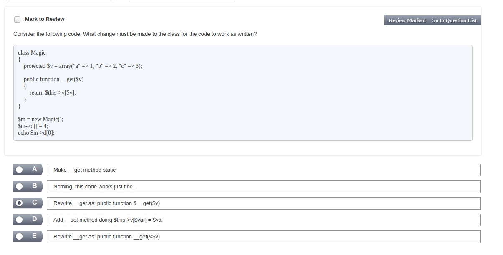

-------------
The Active Record design pattern is used for which of the following?

1.  Separating business and presentation logic within a system
2.  Creating audit trails of all file changes
3.  Managing output handlers
4.  Easily storing and retrieving objects in the database
5.  Integrating PHP and Ruby on Rails projects

------------------

------------

----------------

-----------------

-------------------

------------------

--------

----------

-----------

---------

---------

----------

------------------
